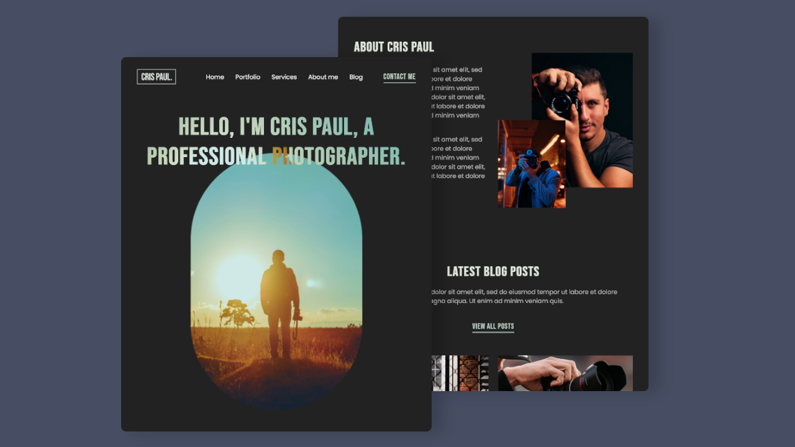

# Personal Photography Portfolio - Cris Paul

## Table of contents

- [Project Description](#project-description)
- [Project thumbnail](#project-thumbnail)
- [View Website ](#view-website)
- [My process](#my-process)
  - [Built with](#built-with)
  - [What I learned](#what-i-learned)
  - [Useful Resources](#useful-resources)
  - [Interesting Articles](#interesting-articles-i-found)
- [Author](#author)
- [Video Credit](#video-credit)

## Project Description

This is personal photography portfolilo website that has some cool features like a slider built with library a11y slider and animate elements with JavaScript libraries.

## Project thumbnail

## My Process

### Built with

 
 

## What I learned

I focused on accessibility a lot when building the website. The navigation was built desktop-first and then went to the mobile version. You don't have to override a lot CSS styles with a max-width media query.
[Mobile-first vs Desktop-first](https://ishadeed.com/article/the-state-of-mobile-first-and-desktop-first/)

## View Website

- Live Demo: [Github Pages](https://bccpadge.github.io/cris-paul-portfolio/)

## Useful Resources

- Make your own favicon icon - [Favicon](https://favicon.io/)

- A11y slider - [Documentation](https://a11yslider.js.org/)

## Interesting Articles I found

- The New Evolution of Responsive Design - [Responsive Design](https://elad.medium.com/the-new-responsive-design-evolution-2bfb9b504a4e)

- [Progressive Enchancement](https://developer.mozilla.org/en-US/docs/Glossary/Progressive_Enhancement)

## Author

## Video credit

- [Watch the tutorial on YouTube](https://youtu.be/E1ZjV2oVTY0)
